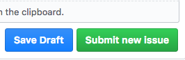
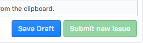

# OctroDraft

Octodraft is a browser extension for Chrome that adds a button to the issues section of github that allows to save a draft of your issue, in case you'd want to complete it later.

When one reports an issue, an example of code is needed. Sometimes making a minimal, reproducible example just takes time, and you don't want to get distracted. It looks something like this:

## Install

Install via github, until the extension is up in Chrome web store.
